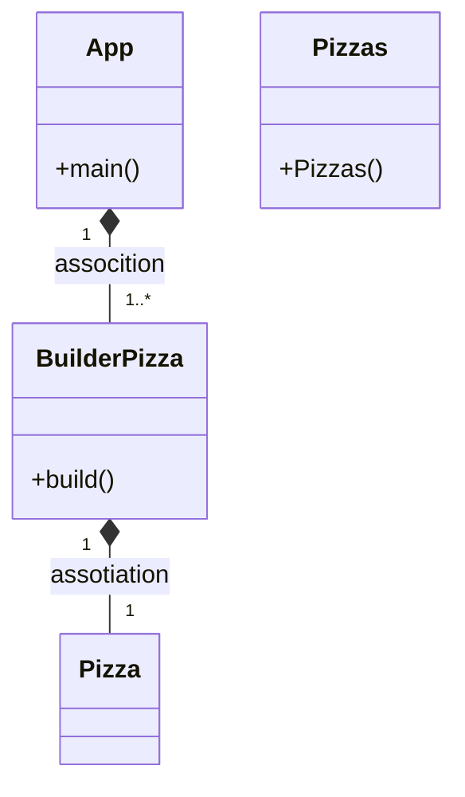

```mermaid
classDiagram
        App "1" *--"1..*" BuilderPizza : assocition
        class App{
            +main()
        }
        class BuilderPizza{
            +build()
        }
        BuilderPizza "1" *-- "1" Pizza : assotiation
        class Pizzas {+Pizzas()}
```